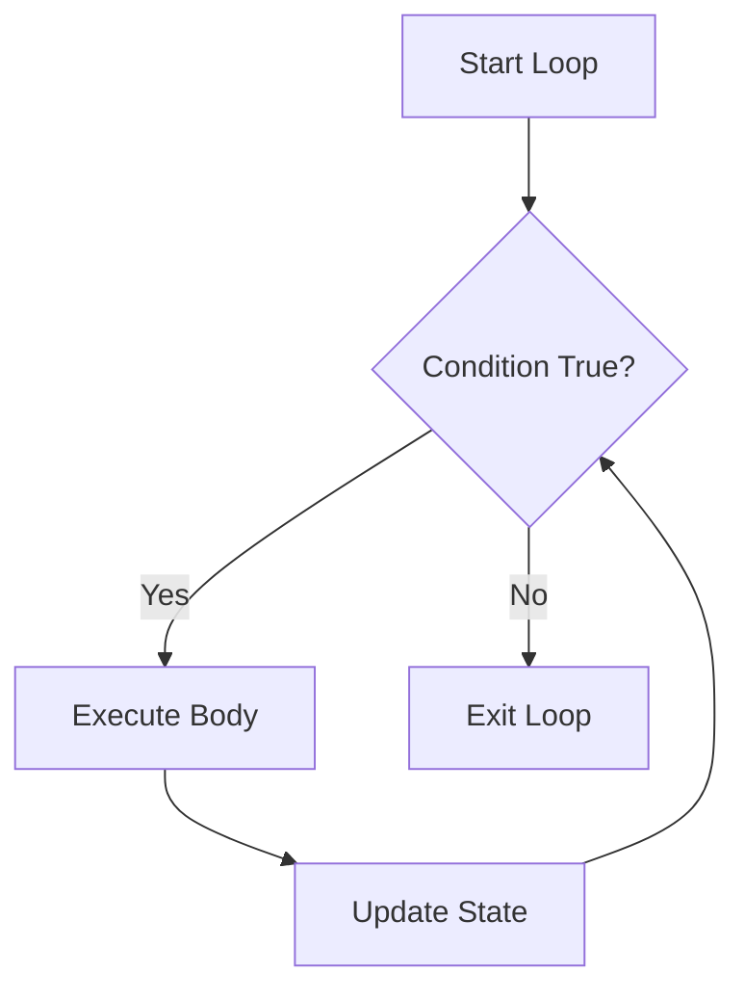
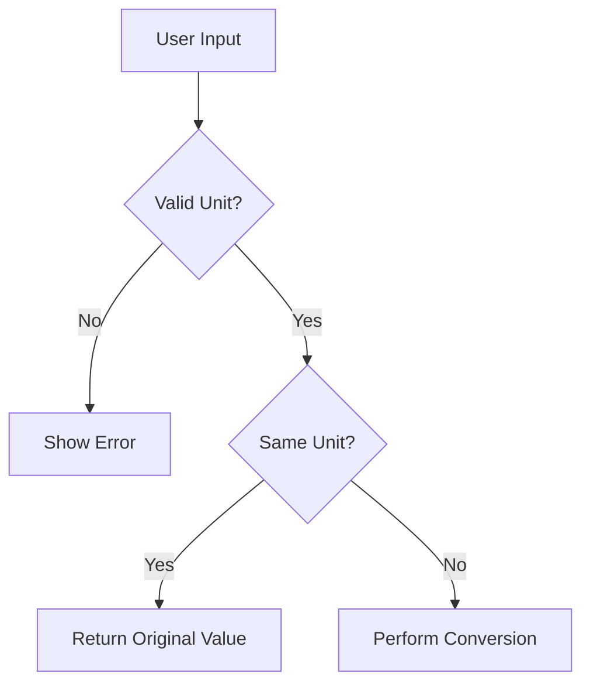

# Variables, Types, and Control Flow in Go

## Introduction

Programming is fundamentally about **storing data**, **making decisions**, and **repeating actions**.
In Go, these responsibilities are handled using:

- Variables
- Data types
- Conditional statements
- Loops
- Control flow structures

This module forms the foundation of all backend development.

Every backend service — whether an authentication system, payment processor, REST API, or distributed system — depends heavily on correct control flow and data handling.

Without mastering these concepts, larger systems become confusing, error-prone, and difficult to maintain.

This chapter focuses not only on syntax, but also on how to **think logically** while writing Go programs.

---

# Learning Objectives

By the end of this module, you should be able to:

- Declare and initialize variables properly
- Understand Go’s basic data types
- Predict and use zero values
- Perform type conversions safely
- Write conditions using `if` and `switch`
- Use loops effectively
- Control execution using `break` and `continue`
- Validate user input
- Structure logic cleanly
- Avoid common beginner mistakes

---

# 1. Variables in Go

Variables are containers used to store data.

In Go, variables are strongly typed, meaning every variable has a specific type.

---

## Declaring Variables Using `var`

```go
var age int = 25
```

This statement contains:

| Part  | Meaning                 |
| ----- | ----------------------- |
| `var` | keyword for declaration |
| `age` | variable name           |
| `int` | variable type           |
| `25`  | assigned value          |

---

## Type Inference

Go can automatically infer types.

```go
var name = "Alice"
```

Go understands that `name` is a `string`.

---

## Short Variable Declaration (`:=`)

Inside functions, Go provides shorthand declaration.

```go
city := "Delhi"
```

This is one of the most common styles in real-world Go code.

---

## Important Rule

`:=` only works inside functions.

Invalid:

```go
name := "Alex"
```

outside functions.

Correct:

```go
var name = "Alex"
```

---

## Variable Naming Best Practices

Good variable names improve readability.

### Good

```go
userCount := 10
temperature := 35.5
```

### Bad

```go
x := 10
t := 35.5
```

unless the scope is extremely small.

---

## Tip

> Prefer clarity over short names.

Backend systems become difficult to maintain when naming is vague.

---

# 2. Basic Data Types

Go provides several primitive data types.

---

## Integer Types

Used for whole numbers.

```go
var age int = 21
```

---

## Floating Point Types

Used for decimal numbers.

```go
var price float64 = 19.99
```

`float64` is preferred because it provides higher precision.

---

## Strings

Used for text.

```go
var language string = "Go"
```

Strings in Go are immutable.

---

## Boolean Type

Represents `true` or `false`.

```go
var isAdmin bool = true
```

Booleans are heavily used in conditions.

---

## Comparison Table

| Type      | Example | Purpose            |
| --------- | ------- | ------------------ |
| `int`     | `10`    | Whole numbers      |
| `float64` | `19.99` | Decimal values     |
| `string`  | `"Go"`  | Text               |
| `bool`    | `true`  | Logical conditions |

---

# 3. Zero Values

One important feature of Go is that variables always have default values.

These are called **zero values**.

---

## Zero Value Table

| Type      | Zero Value |
| --------- | ---------- |
| `int`     | `0`        |
| `float64` | `0`        |
| `string`  | `""`       |
| `bool`    | `false`    |

---

## Example

```go
var x int
var active bool

fmt.Println(x)
fmt.Println(active)
```

Output:

```text
0
false
```

---

## Why Zero Values Matter

Zero values make Go programs safer.

Unlike some languages, Go does not leave variables uninitialized with garbage memory values.

This reduces unexpected behavior.

---

## Important Note

> Zero values are not always meaningful values.

For example:

```go
var balance int
```

A balance of `0` may mean:

- actual zero balance
- or “value not set”

You must design logic carefully.

---

# 4. Constants

Constants cannot change after declaration.

```go
const pi = 3.14159
```

---

## When to Use Constants

Use constants for:

- mathematical values
- configuration flags
- fixed application values

---

## Example

```go
const maxUsers = 100
```

---

# 5. Type Conversion

Go does not allow implicit type conversion.

This prevents hidden bugs.

---

## Invalid Example

```go
var x int = 10
var y float64 = x
```

Error:

```text
cannot use x as float64
```

---

## Correct Conversion

```go
var y float64 = float64(x)
```

---

## Why Explicit Conversion Matters

Automatic conversions can silently lose precision or produce unexpected behavior.

Go forces developers to be intentional.

---

# 6. Conditional Statements

Conditions control decision making.

---

# `if` Statement

```go
age := 20

if age >= 18 {
    fmt.Println("Adult")
}
```

---

## Boolean Requirement

Conditions must evaluate to `bool`.

Invalid:

```go
if age {
}
```

Correct:

```go
if age != 0 {
}
```

---

## Why Go Rejects Truthy/Falsy Behavior

Languages like JavaScript allow:

```javascript
if (x)
```

Go intentionally avoids this because it can hide logic errors.

---

## `if-else`

```go
if marks >= 90 {
    fmt.Println("Grade A")
} else {
    fmt.Println("Not Grade A")
}
```

---

## `else if`

```go
if score >= 90 {
    fmt.Println("A")
} else if score >= 75 {
    fmt.Println("B")
} else {
    fmt.Println("C")
}
```

---

# 7. Switch Statements

`switch` is cleaner than large `if-else` chains.

---

## Basic Example

```go
day := 2

switch day {
case 1:
    fmt.Println("Monday")
case 2:
    fmt.Println("Tuesday")
default:
    fmt.Println("Unknown")
}
```

---

## Important Go Behavior

Go switch statements do NOT automatically fall through.

This differs from C or Java.

---

## Fallthrough

```go
switch x {
case 1:
    fmt.Println("One")
    fallthrough
case 2:
    fmt.Println("Two")
}
```

Output:

```text
One
Two
```

---

## Warning

> Avoid excessive use of `fallthrough`.

It can make logic confusing.

---

# 8. Loops in Go

Go only has one looping keyword:

```go
for
```

Despite having one keyword, Go supports multiple loop styles.

---

# Standard Loop

```go
for i := 0; i < 5; i++ {
    fmt.Println(i)
}
```

---

# Condition Loop

```go
x := 0

for x < 5 {
    x++
}
```

This behaves similarly to `while` loops in other languages.

---

# Infinite Loop

```go
for {
    fmt.Println("Running")
}
```

---

# Loop Flow Diagram



---

# 9. Break and Continue

These keywords control loop execution.

---

# `continue`

Skips the remaining part of the current iteration.

```go
for i := 0; i < 5; i++ {
    if i == 2 {
        continue
    }

    fmt.Println(i)
}
```

Output:

```text
0
1
3
4
```

---

# `break`

Terminates the loop completely.

```go
for {
    break
}
```

---

## Important Difference

| Keyword    | Behavior               |
| ---------- | ---------------------- |
| `continue` | Skip current iteration |
| `break`    | Exit loop entirely     |

---

# 10. Input Handling

Go can read user input using `fmt.Scanln`.

---

## Example

```go
var age int

fmt.Scanln(&age)
```

The `&` symbol passes the memory address.

---

## Input Problems

User input is unreliable.

Users may enter:

- invalid types
- empty values
- unexpected data

Programs must validate input carefully.

---

# 11. Input Validation

Validation prevents invalid data from entering program logic.

---

## Example Validation

```go
if age < 0 {
    fmt.Println("Invalid age")
}
```

---

# Using Maps for Validation

Instead of writing:

```go
if unit == "c" || unit == "f" || unit == "k"
```

Use a map.

```go
validUnits := map[string]bool{
    "c": true,
    "f": true,
    "k": true,
}
```

Validation:

```go
if !validUnits[input] {
    fmt.Println("Invalid input")
}
```

---

## Why Maps Are Better

Maps provide:

- cleaner logic
- scalability
- faster lookup
- easier maintenance

---

# 12. Real Project — Temperature Converter

This project combines:

- variables
- conditions
- functions
- validation
- switch statements

---

# Features

The converter supports:

- Celsius ↔ Fahrenheit
- Celsius ↔ Kelvin
- Fahrenheit ↔ Kelvin

---

# Example Conversion Function

```go
func c2f(temp float64) float64 {
    return (9.0/5.0)*temp + 32
}
```

---

# Input Validation Flow



---

# Best Practices

## 1. Validate Early

Bad:

```go
if invalid {
} else {
    // main logic
}
```

Better:

```go
if invalid {
    return
}

// main logic
```

---

## 2. Use Meaningful Names

Good:

```go
temperature
userCount
```

Bad:

```go
t
x
```

---

## 3. Keep Logic Simple

Prefer readable code over clever code.

---

## 4. Avoid Global Variables

Prefer local variables whenever possible.

---

# Common Mistakes

## Wrong Formulas

Mixing temperature scales incorrectly.

---

## Forgetting Type Conversion

```go
var x int
var y float64 = x
```

---

## Infinite Loops

```go
for x >= 0 {
}
```

without updating `x`.

---

## Incorrect Validation

Failing to check invalid user input.

---

## Misusing Continue

Skipping counter updates accidentally.

---

# Advanced Thinking

As programs grow larger:

- control flow becomes harder
- nested conditions become messy
- validation logic expands

This is why clean structure matters early.

Small habits scale into large system quality.

---

# Summary

In this module, you learned:

- Variable declaration
- Go data types
- Zero values
- Constants
- Type conversion
- Conditional logic
- Switch statements
- Loops
- Break and continue
- Input handling
- Validation patterns

These concepts form the core of all backend programming.

Without strong control flow skills, backend systems become fragile and unpredictable.

---

# Key Takeaways

- Go favors explicit logic
- Conditions must return booleans
- Zero values are important
- Validation should happen early
- Maps improve validation readability
- Clean control flow matters more than clever code

---

# Practice Questions

1. What is the difference between `var` and `:=`?
2. Why does Go reject implicit type conversion?
3. What are zero values?
4. Why does Go avoid truthy/falsy behavior?
5. What is the difference between `break` and `continue`?
6. Why is validation important?
7. Why is `switch` often better than long `if-else` chains?
8. What are the advantages of using maps for validation?

---

# Exercises

## Beginner

1. Build a Celsius ↔ Fahrenheit converter.
2. Create a number guessing game.
3. Write a simple calculator using `switch`.

---

## Intermediate

1. Add validation to the calculator.
2. Build a menu-driven CLI application.
3. Create a grading system using conditions.

---

## Challenge

Build a unit converter that supports:

- temperature
- distance
- weight

Requirements:

- input validation
- reusable functions
- switch-based control flow
- clean error handling
