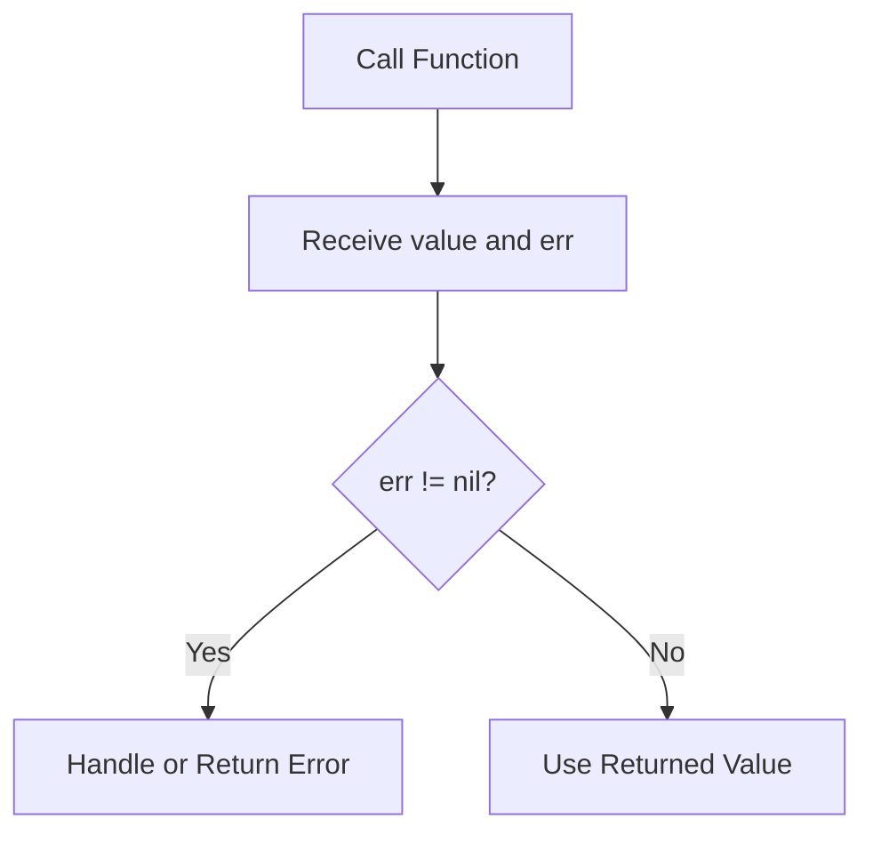
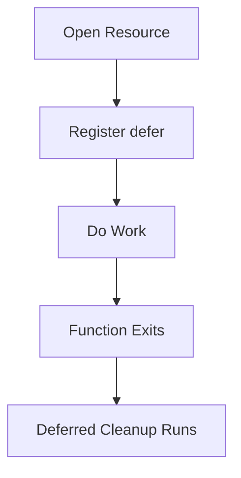
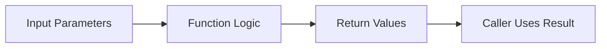

# Functions and Scope in Go

> Building Reusable, Predictable, and Safe Backend Logic

# Introduction

Functions are one of the most important building blocks in software engineering.

Without functions, programs become:

- repetitive
- difficult to debug
- hard to maintain
- impossible to scale

In backend development, functions are everywhere:

- handling HTTP requests
- validating input
- querying databases
- processing business logic
- formatting responses
- managing concurrency

This module introduces the foundations of writing reusable and maintainable Go code using:

- functions
- return values
- scope
- error handling
- `defer`
- `panic`
- `recover`

These concepts are not isolated topics. They work together to create reliable backend systems.

---

# Why Functions Matter

A beginner often thinks:

> “Functions help avoid repeating code.”

That is true, but functions do much more than that.

Functions create:

- structure
- boundaries
- reusable logic
- predictable behavior

A backend service may contain hundreds or thousands of functions working together.

Good backend code is mostly:

- small functions
- clear responsibilities
- controlled data flow
- explicit error handling

---

# Understanding Function Syntax

A simple Go function looks like this:

```go
func add(a int, b int) int {
    return a + b
}
```

---

## Anatomy of a Function

| Part             | Meaning             |
| ---------------- | ------------------- |
| `func`           | Declares a function |
| `add`            | Function name       |
| `(a int, b int)` | Parameters          |
| `int`            | Return type         |
| `return`         | Sends a value back  |

---

# Calling Functions

Functions do nothing until they are called.

Example:

```go
package main

import "fmt"

func greet(name string) string {
    return "Hello " + name
}

func main() {
    message := greet("Aman")
    fmt.Println(message)
}
```

Output:

```text
Hello Aman
```

---

# Parameters and Arguments

Parameters are variables declared inside the function definition.

```go
func greet(name string)
```

`name` is a parameter.

Arguments are actual values passed into the function.

```go
greet("Aman")
```

`"Aman"` is an argument.

---

# Returning Values

Functions can return data back to the caller.

Example:

```go
func square(n int) int {
    return n * n
}
```

Usage:

```go
result := square(5)
fmt.Println(result)
```

Output:

```text
25
```

---

# Multiple Return Values

One of Go’s most important features is multiple return values.

Example:

```go
func divide(a int, b int) (int, int) {
    return a / b, a % b
}
```

Usage:

```go
q, r := divide(10, 3)

fmt.Println(q)
fmt.Println(r)
```

Output:

```text
3
1
```

---

# Why Multiple Returns Matter

Most languages rely heavily on exceptions.

Go takes a different approach.

Instead of throwing exceptions for expected failures, Go returns errors as values.

This pattern exists everywhere:

```go
value, err := someFunction()
if err != nil {
    return err
}
```

This design makes failures explicit.

---

# The Go Error Handling Philosophy

Go prefers:

- explicit code
- visible failures
- predictable execution

Instead of hiding errors in exceptions, Go forces developers to acknowledge them.

This improves:

- readability
- debugging
- maintainability

---

# Returning Errors

Example:

```go
package main

import (
    "fmt"
)

func Divide(a int, b int) (int, error) {
    if b == 0 {
        return 0, fmt.Errorf("divide by zero")
    }

    return a / b, nil
}
```

---

# Understanding the Error Return

When division fails:

```go
return 0, fmt.Errorf("divide by zero")
```

Two values are returned.

| Value   | Meaning                |
| ------- | ---------------------- |
| `0`     | Zero value for int     |
| `error` | Description of failure |

---

# Understanding `nil`

Successful execution:

```go
return a / b, nil
```

`nil` means:

> “No error occurred.”

---

# Standard Error Flow

This is one of the most common patterns in Go:

```go
value, err := Divide(10, 2)

if err != nil {
    return err
}

fmt.Println(value)
```

---

# Execution Flow Diagram



---

# Important Note

> Always check errors before using returned values.

Ignoring this rule causes real backend bugs.

---

# Named Return Values

Go allows naming return variables.

Example:

```go
func rectangle(width int, height int) (area int) {
    area = width * height
    return
}
```

---

## Should You Use Named Returns?

Usually:

- use them sparingly
- avoid overusing them
- prefer explicit returns for readability

Named returns are most useful when:

- deferred functions modify return values
- functions become repetitive

---

# Variadic Functions

Variadic functions accept multiple arguments.

Example:

```go
func sum(numbers ...int) int {
    total := 0

    for _, n := range numbers {
        total += n
    }

    return total
}
```

Usage:

```go
fmt.Println(sum(1, 2, 3, 4))
```

Output:

```text
10
```

---

# Understanding Variadic Parameters

```go
numbers ...int
```

means:

> “Accept any number of integers.”

Internally, variadic parameters behave like slices.

---

# Scope in Go

Scope controls where variables exist.

Example:

```go
func main() {
    x := 10

    if true {
        x := 20
        fmt.Println(x)
    }

    fmt.Println(x)
}
```

Output:

```text
20
10
```

---

# Understanding Scope Properly

Inside the `if` block:

```go
x := 20
```

creates a NEW variable.

It does not update the outer variable.

This is called:

# Shadowing

---

# Shadowing

Shadowing occurs when:

- a new variable
- hides another variable
- with the same name

Example:

```go
err := doThing()

if err != nil {
    err := fmt.Errorf("wrapped error")
}
```

This creates two different `err` variables.

---

# Why Shadowing Is Dangerous

Shadowing causes:

- silent bugs
- confusing logic
- incorrect state updates

The program may:

- compile successfully
- run successfully
- still behave incorrectly

These are some of the hardest bugs to detect.

---

# `:=` vs `=`

This distinction is critical.

| Operator | Purpose                   |
| -------- | ------------------------- |
| `:=`     | Creates new variable      |
| `=`      | Updates existing variable |

---

# Example Comparison

## Creating Variable

```go
x := 10
```

## Updating Variable

```go
x = 20
```

---

# Best Practice

> Avoid unnecessary shadowing.

Use:

- clear variable names
- smaller scopes
- careful `:=` usage

---

# Defer

`defer` delays execution until the surrounding function exits.

Example:

```go
func main() {
    defer fmt.Println("done")

    fmt.Println("working")
}
```

Output:

```text
working
done
```

---

# Understanding Defer

This line:

```go
defer fmt.Println("done")
```

does NOT execute immediately.

It registers the function call to run later.

Execution occurs:

- when the surrounding function exits

---

# Why `defer` Exists

Backend systems constantly manage resources:

- files
- database connections
- HTTP responses
- mutex locks

These resources must be cleaned up safely.

---

# Real Backend Example

```go
file, err := os.Open("data.txt")
if err != nil {
    return err
}

defer file.Close()
```

This guarantees cleanup.

Even if:

- an error occurs
- the function returns early
- panic happens

---

# Defer Execution Flow



---

# Multiple Deferred Calls

`defer` follows:

# LIFO — Last In, First Out

Example:

```go
func test() {
    defer fmt.Println("A")
    defer fmt.Println("B")

    fmt.Println("C")
}
```

Output:

```text
C
B
A
```

---

# Why LIFO Matters

Deferred calls behave like a stack.

The last deferred function runs first.

This is useful for:

- nested cleanup
- layered resource management
- lock ordering

---

# Panic

`panic` immediately stops normal execution.

Example:

```go
panic("something broke")
```

When panic occurs:

- execution stops
- stack unwinds
- deferred functions still run

---

# Error vs Panic

Understanding this distinction is extremely important.

| Use `error` For   | Use `panic` For            |
| ----------------- | -------------------------- |
| Invalid input     | Impossible states          |
| Database failures | Corrupted internal state   |
| Network errors    | Fatal startup failures     |
| Missing files     | Severe programmer mistakes |

---

# Important Warning

> Do NOT use panic for normal backend failures.

Bad:

```go
panic("user not found")
```

Good:

```go
return fmt.Errorf("user not found")
```

---

# Recover

`recover()` catches panics.

It only works inside deferred functions.

Example:

```go
func safe() {
    defer func() {
        if r := recover(); r != nil {
            fmt.Println("Recovered:", r)
        }
    }()

    panic("boom")
}
```

Output:

```text
Recovered: boom
```

---

# Why Recover Matters

Production backend servers should not fully crash because one request failed.

Recovery middleware is commonly used in HTTP servers to:

- catch panics
- log errors
- return safe responses

---

# String Utility Example

## Reverse String

```go
func ReverseString(s string) string {
    var result strings.Builder

    for i := len(s) - 1; i >= 0; i-- {
        result.WriteString(string(s[i]))
    }

    return result.String()
}
```

---

# Why Use `strings.Builder`?

This is inefficient:

```go
result += something
```

Why?

Strings are immutable.

Every concatenation creates a new string.

`strings.Builder` reduces:

- memory allocations
- unnecessary copying
- performance overhead

---

# Important Unicode Warning

This:

```go
s[i]
```

works with bytes.

Not full Unicode characters.

So naive reversal may fail for:

- emojis
- Hindi text
- Japanese characters

Proper Unicode handling requires runes.

---

# Mermaid Diagram — Function Flow



---

# Best Practices

## Keep Functions Small

Small functions are:

- easier to test
- easier to debug
- easier to understand

---

## Return Errors Explicitly

Always prefer:

```go
return value, err
```

instead of hidden behavior.

---

## Use `defer` for Cleanup

Especially for:

- files
- database connections
- mutexes
- HTTP bodies

---

## Avoid Deep Nesting

Bad:

```go
if x {
    if y {
        if z {
        }
    }
}
```

Prefer early returns.

---

# Common Mistakes

## Forgetting Error Checks

Bad:

```go
value, err := doThing()
fmt.Println(value)
```

---

## Shadowing Accidentally

Bad:

```go
err := doThing()

if err != nil {
    err := fmt.Errorf("wrapped")
}
```

---

## Using Panic Incorrectly

Bad:

```go
panic("invalid password")
```

---

## Forgetting Cleanup

Bad:

```go
file, _ := os.Open("x.txt")
```

---

# Key Takeaways

- Functions organize reusable logic.
- Go supports multiple return values.
- Errors are returned explicitly.
- Always check `err` before using values.
- Scope controls variable visibility.
- `:=` may create shadowing bugs.
- `defer` guarantees cleanup.
- `panic` is for severe failures.
- `recover` catches panics safely.

---

# Summary

Functions are the foundation of backend development in Go.

This module introduced:

- reusable logic
- explicit error handling
- scope management
- safe cleanup patterns
- panic recovery concepts

Mastering these ideas is critical because nearly every backend system relies on them heavily.

Most Go backend code is fundamentally built from:

- functions
- returned errors
- deferred cleanup
- predictable execution flow

Understanding these concepts deeply makes later topics significantly easier.

---

# Practice Questions

1. What is the difference between `:=` and `=` in Go?
2. Why does Go prefer returning errors instead of exceptions?
3. What problem does `defer` solve?
4. Why is variable shadowing dangerous?
5. When should `panic` be used?
6. Why does `recover()` only work inside deferred functions?
7. What are the benefits of `strings.Builder`?
8. Why should errors be checked before using return values?

---

# Exercises

## Exercise 1 — Safe Calculator

Build:

- `Add`
- `Subtract`
- `Multiply`
- `Divide`

Use proper error handling.

---

## Exercise 2 — String Utilities

Create functions for:

- reversing strings
- checking palindromes
- counting vowels

---

## Exercise 3 — Scope Debugging

Write examples that:

- accidentally shadow variables
- fix the shadowing issue

---

## Exercise 4 — Defer Practice

Open a file and:

- read contents
- safely close the file using `defer`

---

# Final Thought

A beginner writes code that works.

An engineer writes code that:

- is predictable
- handles failure safely
- cleans up resources properly
- remains maintainable under growth

This module is the beginning of that transition.
