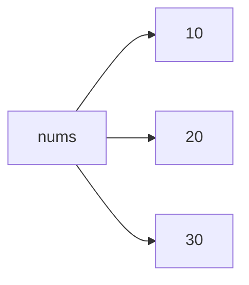
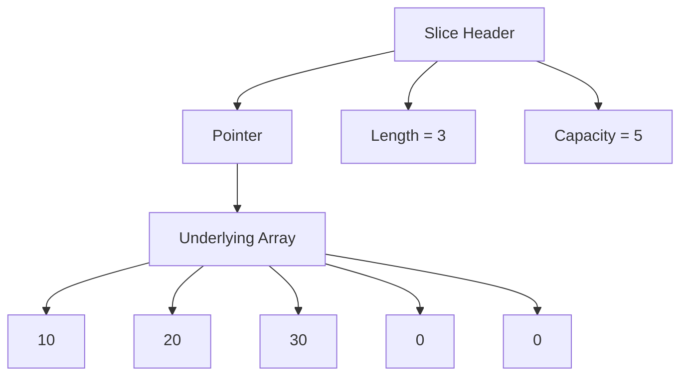
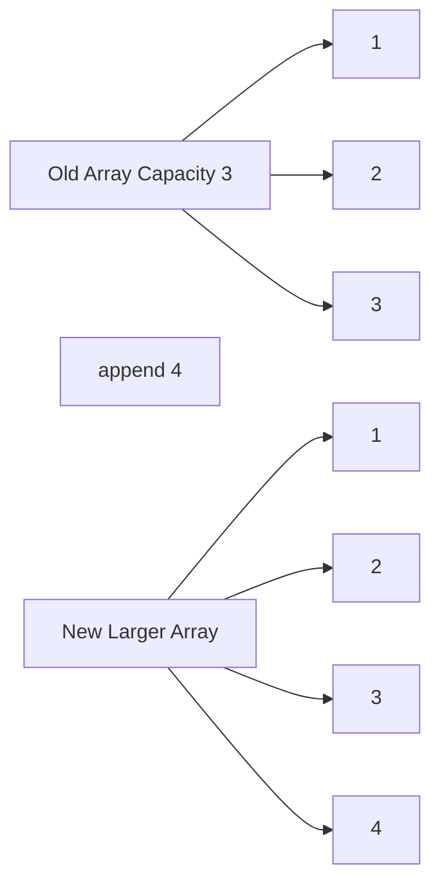

# Chapter 3 — Collections in Go

# Introduction

Modern backend systems process enormous amounts of data.

A backend service may:

- store users
- track requests
- manage sessions
- process logs
- cache results
- paginate responses
- aggregate analytics

To do this effectively, a language needs strong collection types.

In Go, the most important collection types are:

- **Arrays**
- **Slices**
- **Maps**

Although these structures appear simple, they are deeply connected to:

- memory allocation
- performance
- concurrency
- API design
- database handling

Understanding collections properly is one of the biggest milestones in learning Go.

Many bugs in Go applications happen because developers misunderstand:

- slice sharing
- append behavior
- map initialization
- loop variable copies

This chapter builds collections from beginner concepts to practical backend usage.

---

# Understanding Collections

A **collection** is a structure used to store multiple values.

Different collection types solve different problems.

| Collection | Purpose               | Dynamic Size | Ordered | Fast Lookup |
| ---------- | --------------------- | ------------ | ------- | ----------- |
| Array      | Fixed-size storage    | No           | Yes     | No          |
| Slice      | Flexible ordered data | Yes          | Yes     | No          |
| Map        | Key-value lookup      | Yes          | No      | Yes         |

Choosing the correct collection is an important backend skill.

---

# Arrays

## What Is an Array?

An array is a fixed-size sequence of values of the same type.

Example:

```go
var nums [3]int
```

This means:

- array length is fixed at `3`
- all values are integers
- zero values are assigned automatically

Output in memory:

```text
[0 0 0]
```

---

# Array Initialization

Arrays can be initialized directly.

```go
package main

import "fmt"

func main() {
	nums := [3]int{10, 20, 30}

	fmt.Println(nums)
}
```

Output:

```text
[10 20 30]
```

---

# Accessing Elements

Arrays use indexes.

```go
fmt.Println(nums[0])
```

Output:

```text
10
```

Indexes start at `0`.

---

# Array Memory Model

Arrays store data directly.



This matters because arrays are copied completely during assignment.

---

# Arrays Are Value Types

Example:

```go
a := [3]int{1, 2, 3}
b := a

b[0] = 100

fmt.Println(a)
fmt.Println(b)
```

Output:

```text
[1 2 3]
[100 2 3]
```

The original array remains unchanged because the entire array was copied.

---

# Why Arrays Are Rare in Backend Development

Backend systems usually handle dynamic data:

- incoming requests
- database rows
- user sessions
- queues

Fixed-size collections become impractical quickly.

This is why Go developers primarily use **slices**.

---

# Slices

## What Is a Slice?

A slice is a lightweight structure that references an underlying array.

Example:

```go
nums := []int{10, 20, 30}
```

Unlike arrays:

- slices can grow
- slices are flexible
- slices are heavily optimized for backend work

---

# Slice Internals

A slice internally contains:

| Component | Description                          |
| --------- | ------------------------------------ |
| Pointer   | Points to underlying array           |
| Length    | Current number of elements           |
| Capacity  | Maximum elements before reallocation |

---

# Slice Visualization



This internal structure explains many important Go behaviors.

---

# Creating Slices

## Slice Literal

```go
nums := []int{1, 2, 3}
```

---

## Using `make`

```go
nums := make([]int, 3, 5)
```

Format:

```go
make([]Type, length, capacity)
```

Result:

- length = 3
- capacity = 5
- values = `[0 0 0]`

---

# Length vs Capacity

This concept is extremely important.

## Length

The number of active elements currently in the slice.

## Capacity

The amount of memory available before Go must allocate a new array.

---

# Example

```go
nums := make([]int, 3, 5)

fmt.Println(len(nums))
fmt.Println(cap(nums))
```

Output:

```text
3
5
```

---

# Append

## Adding Elements

```go
nums := []int{1, 2, 3}

nums = append(nums, 4)
```

Output:

```text
[1 2 3 4]
```

---

# Why `append` Returns a Slice

This is one of the most misunderstood Go concepts.

When capacity is exceeded:

1. Go allocates a larger array
2. Existing values are copied
3. A new slice is returned

That is why this is required:

```go
nums = append(nums, 5)
```

NOT:

```go
append(nums, 5)
```

---

# Internal Reallocation



---

# Slice Sharing and Memory Behavior

## Slice Assignment Does NOT Copy Data

Example:

```go
a := []int{1, 2, 3}
b := a

b[0] = 100

fmt.Println(a)
fmt.Println(b)
```

Output:

```text
[100 2 3]
[100 2 3]
```

Both slices share the same underlying array.

---

# Important Warning

> **Warning**
>
> Copying a slice does not copy the underlying data.

This creates many real-world backend bugs.

---

# Real Backend Example

Imagine:

```go
cachedUsers := users
```

If one slice changes:

- both datasets change

This may accidentally corrupt cached data.

---

# Proper Slice Copying

## Using `copy`

```go
a := []int{1, 2, 3}

b := make([]int, len(a))

copy(b, a)

b[0] = 100

fmt.Println(a)
fmt.Println(b)
```

Output:

```text
[1 2 3]
[100 2 3]
```

Now the slices are independent.

---

# Slice Expressions

General syntax:

```go
slice[start:end]
```

Rules:

- start is inclusive
- end is exclusive

---

# Examples

## First Three Elements

```go
nums[:3]
```

---

## Middle Section

```go
nums[1:4]
```

---

## Last Two Elements

```go
nums[len(nums)-2:]
```

Go does not support negative indexes.

Invalid:

```go
nums[-2:]
```

---

# Sub-Slices Share Memory

Example:

```go
nums := []int{1, 2, 3}

a := nums[:2]

a[0] = 100

fmt.Println(nums)
fmt.Println(a)
```

Output:

```text
[100 2 3]
[100 2]
```

---

# Important Note

> **Important**
>
> Sub-slices still point to the same underlying array.

---

# Range Loops

The `range` keyword simplifies iteration.

---

# Basic Example

```go
nums := []int{10, 20, 30}

for i, v := range nums {
	fmt.Println(i, v)
}
```

Output:

```text
0 10
1 20
2 30
```

---

# Ignoring Values

## Ignore Index

```go
for _, value := range nums {
	fmt.Println(value)
}
```

---

## Ignore Value

```go
for i := range nums {
	fmt.Println(i)
}
```

---

# Common Range Loop Mistake

This code does NOT modify the original slice:

```go
nums := []int{1, 2, 3}

for _, v := range nums {
	v = v * 2
}

fmt.Println(nums)
```

Output:

```text
[1 2 3]
```

---

# Why This Happens

`v` is a copy of each element.

Modifying the copy changes nothing.

---

# Correct Modification Pattern

```go
for i := range nums {
	nums[i] = nums[i] * 2
}
```

Output:

```text
[2 4 6]
```

---

# Maps

## What Is a Map?

A map stores data using key-value pairs.

Example:

```go
ages := map[string]int{
	"Alice": 25,
	"Bob": 30,
}
```

Maps are extremely important in backend systems.

---

# Common Backend Uses for Maps

Maps are commonly used for:

- caches
- counters
- lookups
- indexes
- session tracking
- rate limiting

---

# Adding and Updating Values

```go
ages["Charlie"] = 40
```

---

# Reading Values

```go
fmt.Println(ages["Alice"])
```

---

# Deleting Values

```go
delete(ages, "Bob")
```

---

# Zero Values in Maps

Example:

```go
scores := map[string]int{}

fmt.Println(scores["unknown"])
```

Output:

```text
0
```

Missing keys return the zero value.

---

# The Comma-OK Idiom

This pattern checks whether a key exists.

```go
value, exists := scores["Alice"]
```

---

# Example

```go
scores := map[string]int{
	"Alice": 10,
}

value, exists := scores["Bob"]

fmt.Println(value)
fmt.Println(exists)
```

Output:

```text
0
false
```

---

# Nil Maps

This causes panic:

```go
var users map[string]int

users["alice"] = 1
```

Error:

```text
panic: assignment to entry in nil map
```

---

# Correct Initialization

```go
users := make(map[string]int)
```

OR:

```go
users := map[string]int{}
```

---

# Struct Collections

Backend systems usually store structs inside slices.

Example:

```go
type Task struct {
	ID   int
	Name string
	Done bool
}
```

---

# Slice of Structs

```go
tasks := []Task{
	{ID: 1, Name: "Task 1", Done: false},
	{ID: 2, Name: "Task 2", Done: true},
}
```

---

# Updating Structs in Slices

Correct:

```go
tasks[0].Done = true
```

---

# Common Struct Loop Bug

Wrong:

```go
for _, task := range tasks {
	task.Done = true
}
```

Why?

- `task` is a copy

Correct:

```go
for i := range tasks {
	tasks[i].Done = true
}
```

---

# Building a Simple Contact Book

Example:

```go
type Contact struct {
	Name  string
	Phone string
}
```

---

# Using Slices and Maps Together

A common backend pattern:

```go
var contacts []Contact
var contactIndex map[string]int
```

Why use both?

| Structure | Purpose        |
| --------- | -------------- |
| Slice     | Maintain order |
| Map       | Fast lookup    |

This is common in:

- caches
- indexes
- repositories
- API response builders

---

# Backend Perspective

Collections are foundational to backend systems.

Slices are used for:

- API responses
- database query results
- pagination
- batching

Maps are used for:

- caching
- indexing
- aggregation
- metrics
- state tracking

Understanding memory behavior improves:

- performance
- correctness
- concurrency safety

---

# Best Practices

## Prefer Slices Over Arrays

Arrays are too rigid for most backend systems.

---

## Always Reassign `append`

Correct:

```go
nums = append(nums, value)
```

---

## Use `copy` for Isolation

Prevent accidental shared memory bugs.

---

## Initialize Maps Before Writing

Always use:

- `make`
- map literals

---

## Be Careful With Range Variables

Remember:

- range values are copies

---

# Common Mistakes

| Mistake                               | Problem                 |
| ------------------------------------- | ----------------------- |
| Forgetting append reassignment        | Data loss               |
| Modifying range variable              | Original data unchanged |
| Writing to nil map                    | Panic                   |
| Assuming slice assignment copies data | Shared-memory bugs      |
| Using sub-slices carelessly           | Unexpected mutations    |

---

# Key Takeaways

- Arrays are fixed-size value types
- Slices are dynamic views over arrays
- Slices share underlying memory
- `append` may allocate new arrays
- `copy` creates independent slices
- Range values are copies
- Maps provide fast lookup
- Nil maps panic on writes
- Collections are core backend building blocks

---

# Summary

Collections are one of the most important parts of Go.

Although arrays, slices, and maps appear simple at first, they directly affect:

- performance
- memory usage
- correctness
- architecture decisions

Mastering collections is essential before moving into:

- structs
- interfaces
- concurrency
- HTTP servers
- databases

Most backend systems are fundamentally collections of structured data moving through different layers.

Understanding how Go handles that data internally is what separates beginner Go developers from competent backend engineers.

---

# Practice Questions

1. What is the difference between an array and a slice?

2. Why does `append` return a new slice?

3. What is the difference between slice length and capacity?

4. Why does modifying one slice sometimes affect another slice?

5. What does the `copy` function do?

6. Why does modifying a range variable not change the original slice?

7. What happens when writing to a nil map?

8. What is the comma-ok idiom used for?

9. Why are maps useful in backend systems?

10. Explain a real-world bug caused by shared slice memory.

---

# Practice Exercises

## Exercise 1 — Reverse a Slice

Write a function that reverses a slice of integers.

---

## Exercise 2 — Word Frequency Counter

Count word occurrences using:

- `strings.Fields`
- maps
- range loops

---

## Exercise 3 — Task Tracker

Create:

- `Task` struct
- slice of tasks
- functions for add/update/list

---

## Exercise 4 — Contact Book

Build:

- contact storage
- fast lookup using maps
- update functionality

---

# Final Note

Collections are not just syntax.

They are memory structures.

Understanding them deeply will make:

- concurrency easier
- APIs cleaner
- debugging simpler
- backend systems more reliable

This chapter forms the foundation for nearly every advanced topic in Go backend development.
