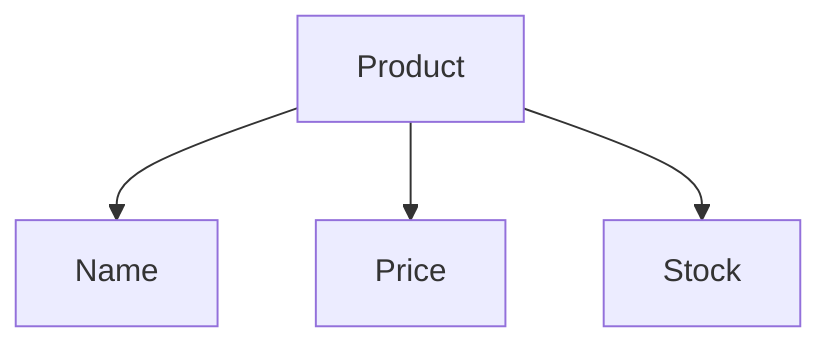
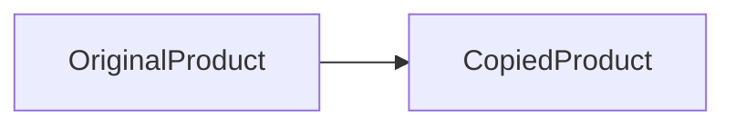
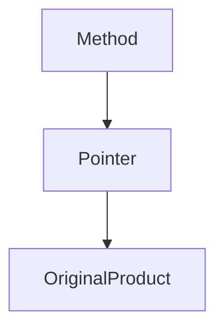
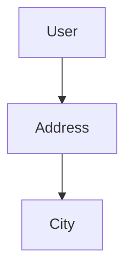

# Structs, Methods, and Pointers in Go

## Introduction

Up to this point, programming in Go has mostly involved writing functions and working with built-in data types such as slices, maps, strings, and integers. While those tools are powerful, real backend applications require something more important:

> The ability to model real-world data cleanly.

Backend systems deal with users, products, orders, carts, APIs, database records, configurations, sessions, and much more. These things are not simple integers or strings. They are structured entities with behavior and state.

This is where **structs**, **methods**, and **pointers** become essential.

In Go, these concepts form the foundation of almost every backend application:

- HTTP request models
- Database entities
- Service layers
- Configuration systems
- Authentication objects
- Caches
- Concurrent systems

Understanding this chapter properly is critical because almost every production Go application heavily relies on these concepts.

---

# Why Structs Exist

Imagine building an e-commerce application.

A product has:

- a name
- a price
- stock quantity

Without structs, you would need separate variables:

```go
productName := "Laptop"
productPrice := 50000
productStock := 10
```

This quickly becomes unmanageable.

A better approach is grouping related data together.

---

# Understanding Structs

A **struct** is a custom data type that groups related fields together.

## Basic Struct Syntax

```go
type Product struct {
	Name  string
	Price int
	Stock int
}
```

This creates a new type called `Product`.

The struct contains three fields:

- `Name`
- `Price`
- `Stock`

Each field has a type.

---

# Visualizing a Struct



A struct behaves like a container for related information.

---

# Creating Struct Values

## Struct Literals

The most common way to create structs is using struct literals.

```go
p1 := Product{
	Name:  "Keyboard",
	Price: 2500,
	Stock: 10,
}
```

This style is called **named field initialization**.

---

# Positional Initialization

Go also allows positional initialization.

```go
p1 := Product{"Keyboard", 2500, 10}
```

Although shorter, this approach is risky.

If field order changes later, code may silently break.

---

## Best Practice

> Prefer named fields in backend code.

Named fields improve:

- readability
- maintainability
- debugging
- refactoring safety

---

# Accessing Struct Fields

Struct fields are accessed using dot notation.

```go
fmt.Println(p1.Price)
```

Output:

```text
2500
```

---

# Methods in Go

Structs store data.

Methods define behavior attached to that data.

A method is simply a function with a receiver.

---

# Method Syntax

```go
func (p Product) IsAvailable() bool {
	return p.Stock > 0
}
```

The receiver:

```go
(p Product)
```

means:

- this method belongs to `Product`

---

# Calling Methods

```go
fmt.Println(p1.IsAvailable())
```

Output:

```text
true
```

---

# Structs + Methods = Real Data Models

This is where Go begins feeling like backend engineering.

You are no longer just writing functions.

You are modeling systems.

---

# Value Receivers

The method below uses a **value receiver**:

```go
func (p Product) AddOne() {
	p.Stock++
}
```

At first glance, this seems correct.

But there is a hidden problem.

---

# Understanding Value Copies

When using:

```go
func (p Product)
```

Go creates a copy of the struct.

Visualized:



The method modifies the copy, not the original object.

---

# Example

```go
package main

import "fmt"

type Product struct {
	Stock int
}

func (p Product) AddOne() {
	p.Stock++
}

func main() {
	p := Product{Stock: 10}

	p.AddOne()

	fmt.Println(p.Stock)
}
```

Output:

```text
10
```

Not `11`.

Because the original value never changed.

---

# Pointer Receivers

To modify the original struct, use pointers.

```go
func (p *Product) AddOne() {
	p.Stock++
}
```

Now the method operates on the original object in memory.

---

# Memory Visualization



The pointer references the original struct instead of copying it.

---

# Why Pointer Receivers Matter

Pointer receivers are one of the most important concepts in Go backend development.

They are used for:

- database models
- service layers
- caches
- HTTP handlers
- mutable state
- large structs

---

# Comparing Value vs Pointer Receivers

| Feature                      | Value Receiver | Pointer Receiver |
| ---------------------------- | -------------- | ---------------- |
| Copies struct                | Yes            | No               |
| Can modify original          | No             | Yes              |
| Better for large structs     | No             | Yes              |
| Safer for immutable behavior | Yes            | Sometimes        |
| Common in backend apps       | Less           | Very common      |

---

# Example: Modifying Data

```go
func (p *Product) AddStock(amount int) {
	p.Stock += amount
}
```

Usage:

```go
p1.AddStock(5)
```

---

# Important Rule

If most methods on a struct use pointer receivers, it is usually best to use pointer receivers consistently.

This prevents:

- confusion
- interface issues
- accidental copying

---

# Methods That Do Not Need Pointers

Methods that only read data can safely use value receivers.

Example:

```go
func (p Product) IsAvailable() bool {
	return p.Stock > 0
}
```

No mutation occurs.

---

# Struct Composition

Go does not strongly encourage inheritance like traditional OOP languages.

Instead, Go prefers:

> composition over inheritance

---

# Basic Composition

```go
type Address struct {
	City    string
	Country string
}

type User struct {
	Name    string
	Address Address
}
```

Usage:

```go
u.Address.City
```

---

# Struct Embedding

Embedding is a special form of composition.

```go
type Address struct {
	City string
}

type User struct {
	Name string
	Address
}
```

Now fields are promoted automatically.

Usage:

```go
u.City
```

instead of:

```go
u.Address.City
```

---

# Embedding Diagram



Embedding creates cleaner APIs.

---

# Embedding Pointers

Go also allows embedding pointers.

```go
type Engine struct {
	HorsePower int
}

type Car struct {
	*Engine
	Brand string
}
```

---

# Why Embed Pointers?

Pointer embedding is useful for:

- avoiding copies
- shared mutable state
- services
- database connections
- configurations

---

# Warning About Nil Embedded Pointers

This is dangerous:

```go
car := Car{}

fmt.Println(car.HorsePower)
```

This causes a panic because:

- `Engine == nil`

---

# Exported vs Unexported Identifiers

Go controls visibility using capitalization.

---

# Exported Identifiers

Uppercase names are exported.

```go
type User struct {}
func CreateUser() {}
```

Accessible from other packages.

---

# Unexported Identifiers

Lowercase names are private to the package.

```go
type user struct {}
func createUser() {}
```

---

# Example

```go
type User struct {
	Name     string
	email    string
	Age      int
	password string
}
```

Exported:

- `Name`
- `Age`

Unexported:

- `email`
- `password`

---

# Why This Matters

Sensitive data should often remain unexported.

Example:

```go
type User struct {
	password string
}
```

Instead of direct access:

```go
user.password = "123"
```

use controlled methods:

```go
func (u *User) SetPassword(raw string)
```

This allows:

- validation
- hashing
- security checks

---

# Real-World Backend Example

## Inventory System

```go
package main

import "fmt"

type Product struct {
	Name  string
	Stock int
	Price float32
}

type CartItem struct {
	Product  Product
	Quantity int
}

type Cart struct {
	Items []CartItem
}

type User struct {
	Name string
	Cart
}

func (p *Product) AddStock(amount int) {
	p.Stock += amount
}

func (p *Product) RemoveStock(amount int) {
	p.Stock -= amount
}

func (p *Product) IsAvailable(quantity int) bool {
	return p.Stock >= quantity
}

func (c *Cart) AddToCart(quantity int, p *Product) {
	if p.IsAvailable(quantity) {
		item := CartItem{
			Product:  *p,
			Quantity: quantity,
		}

		c.Items = append(c.Items, item)

		p.RemoveStock(quantity)

		fmt.Println(quantity, p.Name, "added to cart")
	} else {
		fmt.Println("Not enough stock")
	}
}

func (c Cart) TotalPrice() float32 {
	var total float32

	for _, item := range c.Items {
		total += item.Product.Price * float32(item.Quantity)
	}

	return total
}

func main() {
	laptop := Product{
		Name:  "Laptop",
		Stock: 5,
		Price: 50000,
	}

	user := User{
		Name: "Aryan",
	}

	user.AddToCart(2, &laptop)

	fmt.Println(user.TotalPrice())
}
```

---

# Important Design Discussion

## Copy vs Pointer in CartItem

This design:

```go
Product Product
```

stores a copy of the product.

Alternative:

```go
Product *Product
```

stores a reference.

---

# Snapshot vs Live Data

This is a real backend design decision.

| Approach      | Behavior                            |
| ------------- | ----------------------------------- |
| Store copy    | Keeps historical snapshot           |
| Store pointer | Always reflects latest product data |

Example:

- price changes later
- should old cart keep original price?

Real systems must decide carefully.

---

# Best Practices

## Use Pointer Receivers When

- modifying state
- struct is large
- consistency matters
- avoiding copies

---

## Prefer Named Struct Initialization

Good:

```go
Product{
	Name: "Laptop",
}
```

Avoid:

```go
Product{"Laptop", 50000, 5}
```

---

## Keep Sensitive Fields Unexported

Never expose:

- passwords
- tokens
- secrets
- internal state

directly.

---

## Validate State Mutations

Bad:

```go
p.Stock -= amount
```

Better:

```go
if amount <= 0 {
	return
}
```

---

# Common Mistakes

## Using Value Receivers for Mutations

```go
func (p Product) Update()
```

This modifies only copies.

---

## Forgetting Nil Pointer Risks

Embedded pointers can panic if not initialized.

---

## Exposing Internal Fields

Avoid exporting sensitive internals unnecessarily.

---

## Overusing Embedding

Embedding is powerful but can create confusing APIs if abused.

---

# Advanced Insight

Go’s simplicity hides deep design philosophy.

Structs + methods + interfaces form Go’s alternative to traditional OOP inheritance.

Instead of:

- deep class hierarchies
- inheritance trees
- complex polymorphism

Go encourages:

- small focused types
- composition
- interfaces
- explicit behavior

This becomes extremely important in backend architecture.

---

# Summary

In this chapter, you learned:

- how structs model real-world data
- how methods attach behavior to structs
- how value receivers create copies
- how pointer receivers modify original data
- how composition and embedding work
- how visibility rules function in Go
- how these ideas apply to backend systems

These concepts are foundational to:

- APIs
- databases
- services
- authentication
- concurrency
- architecture

Without mastering these ideas, professional Go backend development becomes extremely difficult.

---

# Key Takeaways

- Structs group related data.
- Methods define behavior.
- Value receivers copy structs.
- Pointer receivers modify original data.
- Embedding promotes composition.
- Capitalization controls visibility.
- Backend applications rely heavily on these concepts.

---

# Practice Questions

1. What is the difference between a struct and a map?
2. Why do value receivers fail to modify original structs?
3. When should pointer receivers be preferred?
4. What is the difference between composition and inheritance?
5. Why might storing copies inside cart items be useful?
6. What risks exist with embedded pointers?
7. Why should passwords usually remain unexported?
8. What happens when a struct is passed by value?
9. Why does Go prefer composition over inheritance?
10. What are the tradeoffs between storing pointers and copies?

---

# Practice Exercises

## Exercise 1 — User Model

Create a `User` struct with:

- first name
- last name
- email

Add:

- `FullName()`
- `IsValidEmail()`

---

## Exercise 2 — Bank Account

Build:

- `Deposit()`
- `Withdraw()`
- `Balance()`

Use proper pointer receivers.

---

## Exercise 3 — Inventory System

Create:

- `Product`
- `Order`
- `OrderItem`

Requirements:

- reduce stock
- calculate totals
- validate availability

---

## Exercise 4 — Pointer Experiment

Create:

- one method using value receiver
- one using pointer receiver

Observe memory behavior.

---

# Final Thought

Structs, methods, and pointers are where Go transitions from “learning syntax” into “building systems.”

This chapter is not just beginner material.

These exact concepts appear in:

- production APIs
- databases
- distributed systems
- cloud services
- high-performance backends

Master them deeply.
