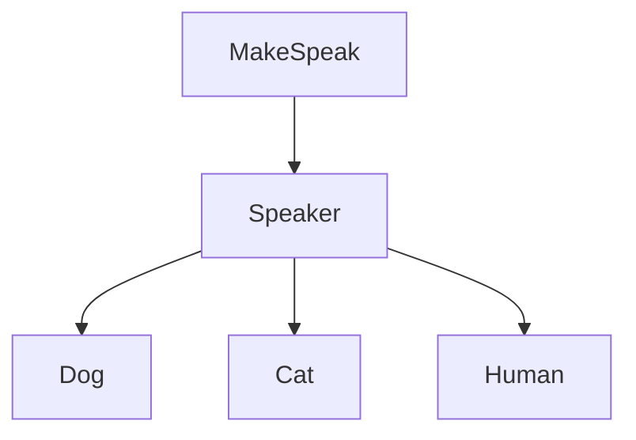
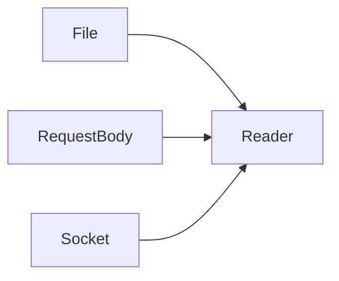
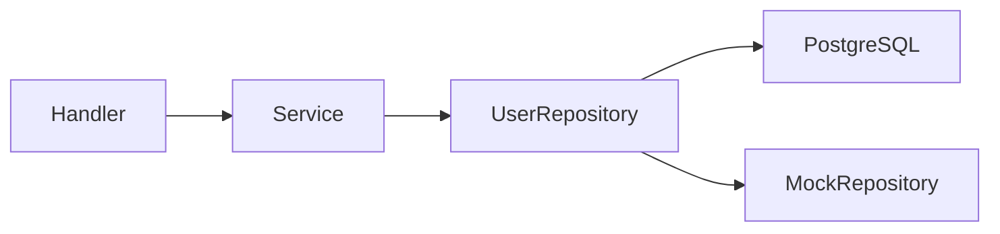

# Interfaces and Polymorphism in Go

# Introduction

Interfaces are one of the most important features in Go. They are the foundation of flexible backend architecture, reusable code, testing, dependency injection, and many parts of Go’s standard library.

Unlike traditional object-oriented languages such as Java or C++, Go does not use inheritance heavily. Instead, Go focuses on **behavior-based design** using interfaces.

This chapter explains:

- What interfaces are
- How polymorphism works in Go
- Implicit implementation
- Pointer vs value receiver behavior
- Type assertions and type switches
- `io.Reader` and `io.Writer`
- Interface composition
- Real backend architecture patterns
- Testing and mocking with interfaces

By the end of this chapter, you should be able to design decoupled and testable backend systems using idiomatic Go patterns.

---

# Understanding Interfaces

## What Is an Interface?

An interface in Go is a **contract of behavior**.

It describes _what something can do_, not _what something is_.

An interface defines methods that a type must implement.

Example:

```go
type Speaker interface {
	Speak()
}
```

This means:

> Any type with a `Speak()` method satisfies this interface.

---

## Why Interfaces Exist

Interfaces solve a major software engineering problem:

> How can different types be used through a common behavior?

Consider:

- A dog can speak
- A cat can speak
- A robot can speak

Even though they are different types, they share one behavior.

Interfaces allow us to treat them uniformly.

---

# Implicit Implementation

One of Go’s most important design choices is:

> Interfaces are implemented implicitly.

Unlike Java:

```java
class Dog implements Speaker
```

Go does not require explicit declarations.

---

## Example

```go
package main

import "fmt"

type Speaker interface {
	Speak()
}

type Dog struct{}

func (d Dog) Speak() {
	fmt.Println("Woof")
}

func main() {
	var s Speaker

	s = Dog{}

	s.Speak()
}
```

Output:

```text
Woof
```

`Dog` automatically satisfies `Speaker` because it has a `Speak()` method.

---

# Polymorphism in Go

## What Is Polymorphism?

Polymorphism means:

> One interface, many implementations.

A single function can behave differently depending on the actual type passed into it.

---

## Example

```go
package main

import "fmt"

type Speaker interface {
	Speak()
}

type Dog struct{}

func (d Dog) Speak() {
	fmt.Println("Woof")
}

type Cat struct{}

func (c Cat) Speak() {
	fmt.Println("Meow")
}

func MakeSpeak(s Speaker) {
	s.Speak()
}

func main() {
	MakeSpeak(Dog{})
	MakeSpeak(Cat{})
}
```

Output:

```text
Woof
Meow
```

The same function behaves differently for different types.

---

# Visualizing Polymorphism



The function depends on behavior rather than concrete types.

---

# Interfaces with Return Values

Interfaces often define methods that return data.

Example:

```go
type Shape interface {
	Area() float64
}
```

---

## Rectangle Implementation

```go
type Rectangle struct {
	Width  float64
	Height float64
}

func (r Rectangle) Area() float64 {
	return r.Width * r.Height
}
```

---

## Circle Implementation

```go
type Circle struct {
	Radius float64
}

func (c Circle) Area() float64 {
	return 3.14 * c.Radius * c.Radius
}
```

Both satisfy the `Shape` interface.

---

# Pointer Receivers vs Value Receivers

This is one of the most important interface concepts in Go.

---

# Value Receiver

```go
type User struct{}

func (u User) Speak() {}
```

This method belongs to:

```go
User
```

and also works with:

```go
*User
```

---

# Pointer Receiver

```go
func (u *User) Speak() {}
```

This method belongs only to:

```go
*User
```

---

# Important Rule

| Receiver Type | Satisfies Interface |
| ------------- | ------------------- |
| `(u User)`    | `User` and `*User`  |
| `(u *User)`   | only `*User`        |

---

# Why This Matters

Pointer receivers are commonly used when:

- modifying state
- avoiding large copies
- sharing resources
- managing connections

Backend systems often use pointer receivers for:

- database repositories
- services
- caches
- HTTP handlers

---

# Example

```go
type Counter struct {
	value int
}

func (c *Counter) Increment() {
	c.value++
}
```

Only `*Counter` satisfies an interface requiring `Increment()`.

---

# Method Sets

The reason behind this behavior is called the **method set**.

---

## Method Set of `User`

Contains:

```go
func (u User) Speak()
```

---

## Method Set of `*User`

Contains:

```go
func (u User) Speak()
func (u *User) Speak()
```

Pointers receive both pointer and value methods.

Values receive only value methods.

---

# Empty Interface and `any`

Older Go versions used:

```go
interface{}
```

Modern Go uses:

```go
any
```

Both are identical.

---

# Meaning of `any`

`any` means:

> This variable can hold any type.

Example:

```go
func Print(v any) {
	fmt.Println(v)
}
```

---

# Real Uses of `any`

`any` is commonly used in:

- generic tooling
- dynamic JSON parsing
- middleware systems
- logging frameworks

---

# Warning

Overusing `any` weakens type safety.

Bad usage:

```go
map[string]any
```

when a proper struct should be used.

---

# Type Assertions

Type assertions extract concrete values from interfaces.

---

## Example

```go
var x any = "golang"

str := x.(string)

fmt.Println(str)
```

Output:

```text
golang
```

---

# Unsafe Assertions

This panics:

```go
var x any = 42

str := x.(string)
```

Runtime error:

```text
panic: interface conversion
```

---

# Safe Assertions

Use the `ok` pattern.

```go
str, ok := x.(string)

if ok {
	fmt.Println(str)
}
```

This prevents panics.

---

# Type Switches

Type switches simplify multiple assertions.

---

## Example

```go
func PrintType(v any) {

	switch t := v.(type) {

	case string:
		fmt.Println("string:", t)

	case int:
		fmt.Println("int:", t)

	default:
		fmt.Println("unknown")
	}
}
```

---

# Why Type Switches Matter

Type switches are useful when handling:

- dynamic JSON
- middleware
- generic systems
- logging
- serialization

---

# `io.Reader` and `io.Writer`

These are among the most important interfaces in Go.

---

# `io.Reader`

Definition:

```go
type Reader interface {
	Read(p []byte) (n int, err error)
}
```

Meaning:

> Something that can provide bytes.

---

# Common Readers

| Type              | Why                    |
| ----------------- | ---------------------- |
| Files             | readable data          |
| HTTP request body | incoming request       |
| TCP connection    | network data           |
| Buffers           | memory data            |
| Strings reader    | readable string stream |

---

# Example

```go
file, _ := os.Open("data.txt")

buf := make([]byte, 10)

n, err := file.Read(buf)
```

---

# Visual Model



---

# `io.Writer`

Definition:

```go
type Writer interface {
	Write(p []byte) (n int, err error)
}
```

Meaning:

> Something that can receive bytes.

---

# Common Writers

| Type          | Why                    |
| ------------- | ---------------------- |
| Files         | data written into file |
| HTTP response | response output        |
| Buffers       | in-memory output       |
| Loggers       | output destination     |

---

# Example

```go
file.Write([]byte("hello"))
```

---

# Reader and Writer Together

Many systems support both.

Example:

```go
type ReadWriter interface {
	io.Reader
	io.Writer
}
```

This is called **interface composition**.

---

# Interface Composition

Go prefers small interfaces that can be combined.

---

## Example

```go
type Reader interface {
	Read(p []byte) (n int, err error)
}

type Writer interface {
	Write(p []byte) (n int, err error)
}

type ReadWriter interface {
	Reader
	Writer
}
```

---

# Benefits of Small Interfaces

Small interfaces are:

- easier to implement
- easier to test
- easier to compose
- more reusable

---

# Go Philosophy

Go strongly prefers:

> Small interfaces over giant abstractions.

---

# Bad Interface Design

```go
type MegaService interface {
	Create()
	Update()
	Delete()
	Close()
	Sync()
	Log()
}
```

Problems:

- tightly coupled
- difficult testing
- hard implementations

---

# Better Design

```go
type Saver interface {
	Save()
}
```

Focused and reusable.

---

# Interfaces in Backend Architecture

Interfaces are heavily used in backend systems.

---

# Repository Pattern Example

```go
type UserRepository interface {
	GetByID(id int) (User, error)
	Create(user User) error
}
```

---

# PostgreSQL Implementation

```go
type PostgresRepository struct{}
```

---

# Mock Implementation

```go
type MockRepository struct{}
```

Both satisfy the same interface.

---

# Architecture Visualization



---

# Why This Matters

The service layer does not care:

- whether data comes from PostgreSQL
- a mock
- Redis
- memory cache

This creates decoupled systems.

---

# Dependency Injection

Interfaces are central to dependency injection.

---

## Example

```go
type UserService struct {
	repo UserRepository
}
```

The service depends on behavior rather than implementation.

---

# Best Practice

## Accept Interfaces, Return Structs

This is a common Go design principle.

Functions usually:

- accept interfaces
- return concrete structs

Example:

```go
func Process(r io.Reader)
```

---

# Mocking and Testing

Interfaces make testing easier.

---

# Example

```go
type PaymentGateway interface {
	Pay(amount int) error
}
```

Production implementation:

```go
type StripeGateway struct{}
```

Testing implementation:

```go
type MockGateway struct{}
```

---

# Why Mocking Matters

Mocking allows:

- isolated testing
- no real API calls
- predictable behavior
- faster tests

---

# Common Mistakes

## 1. Creating Interfaces Too Early

Bad approach:

```go
type UserServiceInterface interface {}
```

before multiple implementations exist.

---

## 2. Huge Interfaces

Large interfaces become difficult to maintain.

Prefer smaller contracts.

---

## 3. Overusing `any`

Too much dynamic typing removes Go’s safety benefits.

---

## 4. Forgetting Pointer Receiver Rules

This causes frequent interface satisfaction errors.

---

# Best Practices

## Use Interfaces for Behavior

Design around actions rather than concrete types.

---

## Keep Interfaces Small

Small interfaces compose better.

---

## Prefer Explicit Structures

Avoid unnecessary abstraction.

---

## Use Mocks in Tests

Mock dependencies instead of calling real services.

---

## Understand Method Sets

Method sets are essential for mastering interfaces.

---

# Important Notes

> Interfaces should simplify architecture, not complicate it.

> Small focused interfaces are more idiomatic than giant frameworks.

> Most Go power comes from composition, not inheritance.

---

# Key Takeaways

- Interfaces define behavior contracts
- Go uses implicit implementation
- Polymorphism allows one interface to support many implementations
- Pointer receivers affect interface satisfaction
- `any` can hold any type
- Type assertions extract concrete values
- Type switches simplify dynamic handling
- `io.Reader` and `io.Writer` are foundational Go interfaces
- Small interfaces are preferred
- Interfaces enable clean backend architecture and testing

---

# Summary

Interfaces are one of the defining features of Go.

They allow programs to become:

- flexible
- decoupled
- testable
- maintainable

Go’s approach is intentionally simple:

- no heavy inheritance
- no complicated object hierarchies
- behavior over structure

Understanding interfaces deeply is a major milestone in becoming an effective Go backend developer.

Many advanced Go concepts — including HTTP servers, databases, middleware, testing, concurrency, and distributed systems — rely heavily on interfaces.

Mastering them is essential for writing professional Go applications.

---

# Practice Questions

1. What problem do interfaces solve in Go?

2. Explain implicit implementation.

3. What is polymorphism?

4. Why does `*User` satisfy some interfaces while `User` does not?

5. What is the difference between `any` and a concrete type?

6. What happens if a type assertion fails?

7. Why are type switches useful?

8. Explain the purpose of `io.Reader`.

9. Why does Go prefer small interfaces?

10. How do interfaces improve testing?

---

# Practice Exercises

## Exercise 1: Logger Interface

Create:

```go
type Logger interface {
	Log(message string)
}
```

Implement:

- ConsoleLogger
- FileLogger

---

## Exercise 2: Storage Interface

Create:

```go
type Storage interface {
	Save(data string)
}
```

Implement:

- MemoryStorage
- FileStorage

---

## Exercise 3: Shape Calculator

Create:

```go
type Shape interface {
	Area() float64
}
```

Implement:

- Circle
- Rectangle
- Triangle

---

## Exercise 4: Reader and Writer

Write a function:

```go
func CopyData(r io.Reader, w io.Writer)
```

that copies data from one source to another.

---

# Final Thought

Go interfaces are powerful because they are simple.

The language does not force large abstraction systems. Instead, it gives developers small composable tools that scale naturally into large backend architectures.

That simplicity is one of the main reasons Go is widely used for backend engineering, cloud systems, APIs, distributed systems, and infrastructure software.
